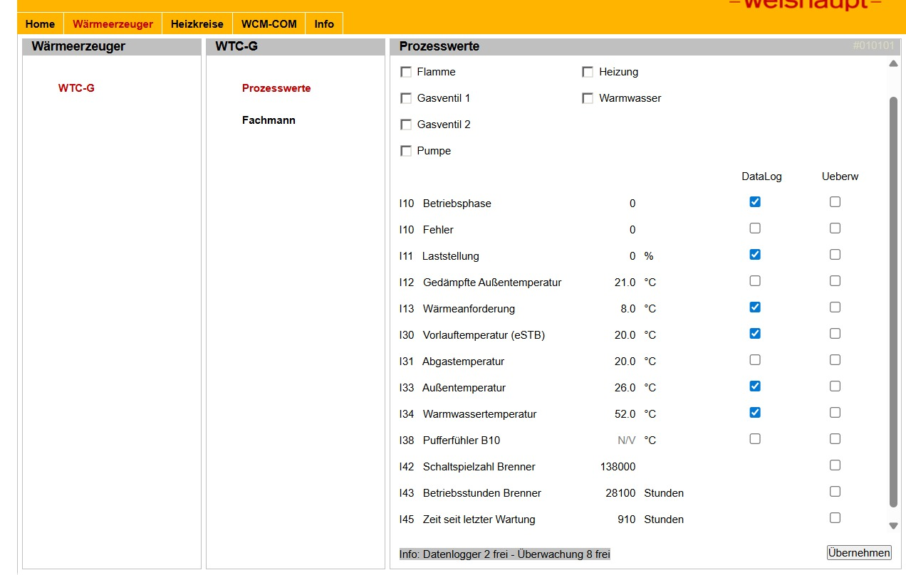
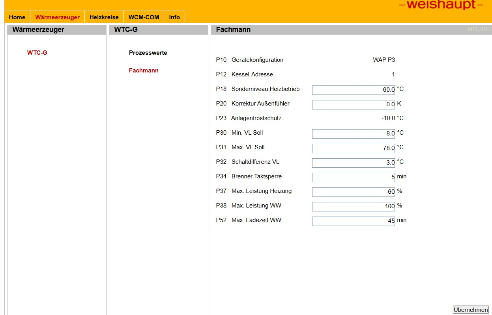

# Py-Weishaupt-WCM-COM

[](LICENSE)

Python library for reading process values from **Weishaupt WCM-COM** heating system network modules.

Used as the backend for the [HA-Weishaupt-WCM-COM](https://github.com/4gismo/HA-Weishaupt-WCM-COM) Home Assistant integration.

---

## Device Interface





---

## Protocol

Communicates with the WCM-COM module via **HTTP POST** with **HTTP Digest Authentication**. Requests and responses use a proprietary JSON telegram format (`"prot": "coco"`).

Parameters are queried in two batches (device processes max ~19 parameters per request). Values are decoded from 16-bit response bytes: signed integers divided by 10 for temperatures, unsigned integers for counters and flags.

---

## Parameters

| ID | Name | Type | Unit | Notes |
|---|---|---|---|---|
| 1 | Error | VALUE | — | |
| 2 | Heat Demand | TEMP | °C | |
| 5 | Room Temperature | TEMP | °C | Normal room temp setpoint (6-byte telegram) |
| 8 | Mixed External Temperature | TEMP | °C | Setback room temp setpoint (6-byte telegram) |
| 12 | Outside Temperature | TEMP | °C | |
| 14 | Warm Water Temperature | TEMP | °C | |
| 31 | Min Flow Temp | TEMP | °C | P30 |
| 34 | Flow Temp Hysteresis | DECIMAL | °C | P32 |
| 39 | Max Flow Temp | TEMP | °C | P31 |
| 81 | Flame | VALUE | — | 0/1 |
| 82 | Heating | VALUE | — | 0/1 |
| 83 | Warm Water | VALUE | — | 0/1 |
| 138 | Burner Load | VALUE | % | |
| 274 | Operating Mode | VALUE | — | 6-byte telegram; writable via `set_operating_mode()` |
| 323 | Burner Lockout Time | VALUE | min | P34 |
| 325 | Flue Gas Temperature | TEMP | °C | |
| 345 | Max DHW Output | DECIMAL | % | P38 |
| 373 | Operating Phase | VALUE | — | |
| 384 | Max DHW Charge Time | VALUE | min | P52 |
| 466 | Pump | VALUE | — | 0/1 |
| 700 | Time Since Last Service | VALUE×10 | h | |
| 1497 | Gas Valve 1 | VALUE | — | 0/1 |
| 1498 | Gas Valve 2 | VALUE | — | 0/1 |
| 2560 | System Frost Protection | TEMP | °C | P23 |
| 3101 | Flow Temperature | TEMP | °C | |
| 3102 | Return Temperature | TEMP | °C | |
| 3158 | Burner Starts | VALUE×1000 | — | |
| 3159 | Burner Hours | VALUE×100 | h | |
| 3793/3792 | Oil Meter | VALUE (combined) | L | Two-register value |

---

## Installation

```bash
pip install git+https://github.com/4gismo/Py-Weishaupt-WCM-COM.git@master
```

---

## Usage

### Read all values

```python
from weishaupt_wcm_com import heat_exchanger
import json

result = heat_exchanger.process_values("192.168.1.100", "user", "password")
data = json.loads(result)
print(data["Flow Temperature"])        # e.g. 65.3
print(data["Outside Temperature"])     # e.g. 8.2
print(data["Burner Load"])             # e.g. 0
```

`process_values()` returns a JSON string on success, or raises an exception on connection / auth / format errors.

### Set operating mode

```python
heat_exchanger.set_operating_mode("192.168.1.100", "user", "password", 3)
# Values: 1=Standby, 3=Normal, 4=Setback, 5=Summer, 11-13=Program 1-3, 255=Follow Master
```

---

## License

Apache License 2.0 — see [LICENSE](LICENSE)
